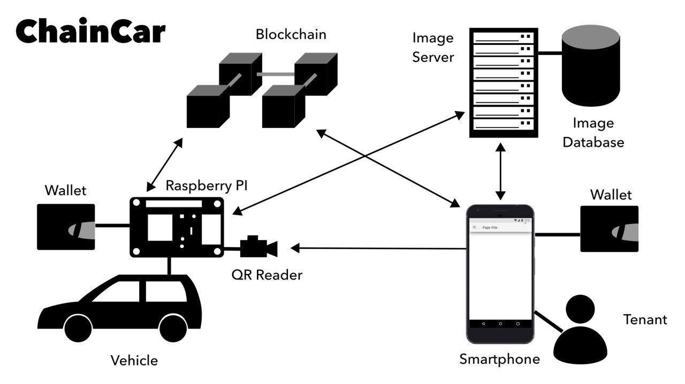

# Pflichtenheft - Projekt “ChainCar” (Gruppe 1 & 2)

[TOC]

## Aufgabenstellung

Mit “ChainCar” soll eine dezentrale Plattform zum Mieten & Vermieten von Automobilen entstehen. Ziel ist die dezentrale Abwicklung der Mietvorgänge sowie der Zugriffskontrolle auf die Fahrzeuge.

Ein Fahrzeugbesitzer kann sein Fahrzeug an der Plattform registrieren und sein Fahrzeug zur Miete freigeben. Dazu gibt er die erforderlichen Daten im Fahrzeug an. Das Fahrzeug selbst registriert sich dann am System. Über einen SmartContract wird das Fahrzeug in der Blockchain persistiert und zur Miete verfügbar gesetzt. Kunden können sich nun  über die App registrieren und nach dem Verbinden der App mit ihrem Wallet verfügbare Fahrzeuge (in einer Liste, ggf. sortiert nach Nähe) einsehen.

Möchte der Kunde ein verfügbares Fahrzeug mieten, wählt er das entsprechende Fahrzeug und die gewünschte Nutzungsdauer. Es wird dann eine Transaktion ausgelöst. Ein SmartContract schreibt den Beginn der Transaktion sowie die Mietkonditionen (Preis, Leistungen, Dauer, …) in die Blockchain, erhebt das Transaktionsentgelt und registriert den Kunden für die Dauer des Mietvorgangs als legitimen Nutzer des Fahrzeuges. Der Kunde kann das Fahrzeug nun entsperren und für die Dauer des Mietvorganges fahren. Nach Ablauf der Miete kann der Mieter den Vorgang auf Wunsch verlängern, andernfalls lässt sich das Auto nicht mehr starten bzw. öffnen.

In der ersten Ausbaustufe ist das Bezahlmodell “Prepaid” vorgesehen. Es wird folglich die Dauer der Nutzung und das zu entrichtende Entgelt im Voraus bestimmt und bezahlt.

## Architektur



Die Chaincar-Plattform besteht im wesentlichen aus den vier Komponenten **Smartphone-App**, **Smart-Vehicle** (Raspberry  Pi), **Image-Server** sowie **Blockchain & Smart-Contract**.
Die Smartphone-App ermöglicht die Suche nach verfügbaren Fahrzeugen und den Mietvorgang. Die App kommuniziert über das Wallet mit der Blockchain und zum Abruf der Fahrzeugbilder mit dem Image-Server. Ebenso generiert die App den Kundenspezifischen Barcode, welcher als Schlüssel zum Fahrzeug dient.
Das Fahrzeug verwaltet sich und seine Daten weitestgehend selbst. Es meldet sich an der Blockchain an, kassiert die Mietkosten vom Nutzer und sammelt diese auf einem eigenen Wallet (pro Fahrzeug). Der Nutzer schließt den Mietvertrag somit direkt mit dem Fahrzeug. Das Fahrzeug selbst kann (in künftigen Versionen) seine Einnahmen nutzen um sie dem Eigentümer auszuzahlen, Reparaturen zu bezahlen oder bspw. Spritkosten/Ladekosten zu decken.

Der Image-Server dient lediglich der Speicherung der Bilddaten der Fahrzeuge (Aussehen, Ausstattungsdetails usw.).

## Ablauf

```sequence
title: ChainCar
participant User as U
participant App as A
participant Vehicle as V
participant Blockchain as B
participant Image Server as S
#Setup Car
V->B: registerCar(id)
B-->V: success;
V->S: uploadPicturesForVehicle(id);
S-->V: ok

#Setup User
note over V: Register User
U->A: Register New User
A->B: registerUser(wallet_adress);
B-->A: user_id
A-->U: Success!

#Avaiilable Cars
note over V: Get all available Cars
A->B: getAvailableVehicles()
B-->A: vehicleList
A->S: getImagesForVehicle(vehicle_id)
S-->A: imagesAsBase64
A-->U: List of Vehicles

#Rent
note over V: Rent a Car & Drive
U->A: Rent Car
A->B: rentVehicle(vehicle_id)
B->B: checkBalance
B->B: New Transaction to Car
B->B: allow User to open Car
B-->A: Transaction completed
A->A: Generate QR-Code
A->V: QR-Code-Scan
V->B: validate User
B->B: Check User allowed
B->V: Granted/Denied
V->V: Open/Lock Doors

#note over S: Transaction stored in TS-DB,\n Auto-Aggregated
```

### Phase 1:

Das Auto registriert sich mit seinen Daten an der Blockchain. Hierbei werden u.A. übermittelt: 

- Nummernschild
- Fahrzeugdaten (Typ, Hersteller, Farbe, PS)
- Mietpreis pro Stunde
- maximale/minimale Mietdauer
- Heimatadresse (Wo Fahrzeug gemietet und wieder abgestellt werden muss)

### Phase 2:

Der Nutzer registriert sich in der App. Er verbindet die App mit einem Wallet (auf demselben Smartphone, ggf. auch entfernt). Die App ruft dann alle verfügbaren Fahrzeuge von der Blockchain ab und lädt deren Bilder vom Image-Server nach. Der Nutzer kann durch die verfügbaren Fahrzeuge scrollen bzw. sie ggf. auf einer Karte einsehen.

### Phase 3:

Entscheidet der Nutzer sich für ein Fahrzeug, kann er einen Mietvorgang starten. Er bestimmt dazu die Nutzungsdauer und die App löst eine Transaktion mit der nötigen Summe aus.

Ein Smart-Contract auf der Blockchain löst die Transaktion auf und übermittelt das Geld an das angefragte Auto. Der Mieter wird als valider Nutzer des Fahrzeugs gespeichert (versehen mit der Nutzungsdauer).

Die App generiert nun einen einmaligen Barcode. Diesen kann der Nutzer am Fahrzeug vorhalten. Das Fahrzeug scannt den Code und fragt mit den Informationen ab, ob der Mieter das Fahrzeug nutzen darf. Im Erfolgsfall wird das Fahrzeug geöffnet und der Mieter kann das Auto nutzen.
Mit Ablauf der Mietdauer muss das Auto wieder am Heimatstandort stehen oder eine Verlängerung des Mietvorgangs vorgenommen sein. Andernfalls kann eine Strafzahlung fällig werden oder der Mieter gesperrt werden.


## Zuständigkeiten im Team:

### Android-App

- Jan Quintus
- Simon Gaugler

### SmartContracts

- Bastian Frewert
- Simon Riethmüller
- Lukas Petric

### Backend

- Lukas Faiß

### Car (Raspberry-Pi)

- Nils Riekers
- Till Fetzer
- Adrian Koslowski
- Benedikt Schulz

