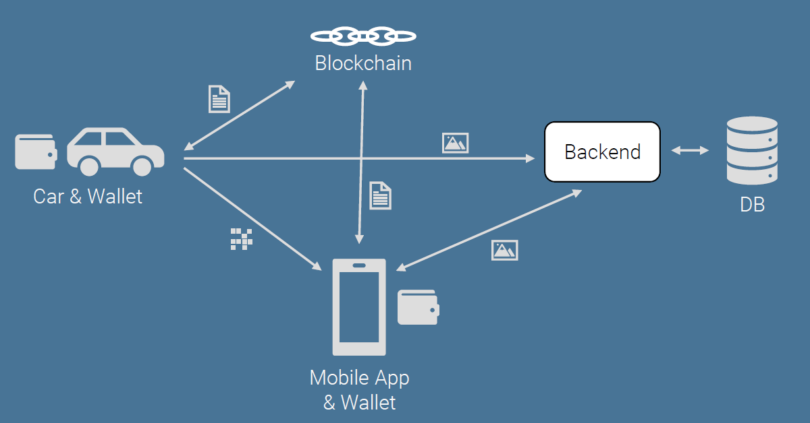
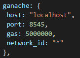

# Verteilte Systeme - Projekt “Carchain”

[TOC]

## Aufgabenstellung, Beschreibung

Mit “ChainCar” soll eine dezentrale Plattform zum Mieten & Vermieten von Automobilen entstehen. Ziel ist die dezentrale Abwicklung der Mietvorgänge sowie der Zugriffskontrolle auf die Fahrzeuge.

Ein Fahrzeugbesitzer kann sich über das Web-Frontend der Plattform registrieren und sein Fahrzeug zur Miete registrieren. Dazu gibt er die erforderlichen Daten an. Über einen SmartContract wird das Fahrzeug in der Blockchain persistiert und zur Miete verfügbar gemacht. Kunden können sich nun ebenfalls über die Website registrieren (mit ihrer Wallet-Adresse) und verfügbare Fahrzeuge (in einer Liste, ggf. sortiert nach Nähe) einsehen.

Möchte der Kunde ein verfügbares Fahrzeug mieten, wird eine Transaktion ausgelöst. Ein SmartContract schreibt den Beginn der Transaktion sowie die Mietkonditionen (Preis, Leistungen, …) in die Blockchain, erhebt eine erstes Transaktionsentgelt und registriert den Kunden als legitimen Nutzer des Fahrzeuges. Der Kunde kann das Fahrzeug nun entsperren (siehe IoT-Team) und fahren. Soll der Mietvorgang beendet werden, wird wieder der SmartContract kontaktiert, welcher die Kosten der Fahrt berechnet, einzieht, dem Vermieter überweist und abschließend die Nutzungsrechte am Fahrzeug wieder entzieht.

Zu klären ist, ob der Eigentümer Zugriff auf sein Fahrzeug haben soll/kann, während ein Kunde dieses gemietet hat oder nicht.

# Architektur

## Komponenten

# Setup
Im Folgenden wird das Setup für die Carchain beschrieben. Um ein funktioniertendes Setup zu erstellen müssen alle Komponenten installiert werden.  
Empfohlene Reihenfolge beim Installieren:
1. Blockchain
2. Smart Contract
3. Datenbank
4. Raspberry Pi
5. App installieren

## Blockchain
Um am Smart Contract zu entwicklen wird eine Blockchain gebraucht um den Smart Contrac auch deployen zu können.
Biser wird dazu Ganache genutzt. Es ist egal ob dabei die Desktop Variante oder Kommandozeielnvariante (Ganache-cli) genutzt wird.  
Um das gleiche Setup zu bekommen wie bisher genutzt wurde und damit richtige Testeinstellungen zu bkeommen muss Ganache installiert werden.  
Zur Installation von Ganache Desktop: https://www.trufflesuite.com/ganache  
Zur Installation von Ganache-cli: https://github.com/trufflesuite/ganache-cli  
 
Wie man die Einstellungen ändert, unterscheidet sich zwischen der Cli und der Desktop Variante. Im Folgenden wird sich auf die CLI Variante beschränkt, da diese am besten einzusetzten sit wenn man nicht nur an der Blockchain entwicklen will sondern auch die Verbindung zu der App oder dem RaspberryPie testen möchte.  
Einstellungen zum Start der Blockchain: 
ganache-cli -m "dragon canoe knife need marine business arctic honey make layer company solar" -h "<IP-Adresse>" -p <Port> -e 10000 & 
 
Die Message die hier Ganache mitgegeben wird bestimmt welche Adressen die Wallets, die schon vornherien genereiert und zur Verfügung gestellt werden, haben. Voreingestllt ist für die Entwicklung 10.000 Ether, die jede Wallet von vornherein bekommt. Sobald der Command ausgeführt wurde gibt es nun eine Blockchian, die für die weitere Entwicklung genutzt werden kann.

## Smart Contract
Um mit den Smart Contracts arbeiten zu können sind einige Installationen nötig.
Diese werden mit npm (dem Node Package Manager) installiert. Zur Installation:  
https://www.npmjs.com/get-npm   
Dazu einfach nach Downlaod des Git Repositpries im Blockchain Ordner folgenden Befehel ausführen: 
npm install 
 
Das Kompilieren, Testen und das Deployen des Smart Contracts geschieht nun mit Truffle. Zu allererst muss dazu im Ordner /Blockchain/ethereum/ die Datei truffle-config.js angepasst werden. Dazu kann ein Server erstellt werden. Ein Beispiel hierfür ist hier zu sehen: 
 
Neben Host und Port gibt es gas. Gas dient dazu zu bestimmen wieviel maximal an Gas ausgegeben werden darf um den Contract zu deployen. Network_id ist auch speziell für die Blockchain, falls es unterschiedlcihe Blockchians auf der gleichen IP gibt. Nachdem die Einstellungen getätigt sind kann nun der Contract compiled und deployed werden. Dazu dient das Kommando: 
truffle migrate --network <Network-Name>  
Der Network-Name ist dabei der Name, der in der truffle-config.js in den networks eingetragen wurde. Weitere Dokumentation zu dem Kommando truffle migrate ist unter  
https://www.trufflesuite.com/docs/truffle/getting-started/running-migrations  
zu finden.

## Datenbank

## App

Derzeit wird die App als APK-Paket angeboten und muss manuell installiert werden. Eine Distribution über die gängigen AppStores wie bspw. GooglePlay ist natürlich angedacht, sobald eine Veröffentlichung denkbar ist.

Um die App zu installieren, muss mittels einem Datei-Manager die APK-Datei ausgewählt werden. In aktuelleren Android Versionen muss zunächst in den Einstellungen die Sicherheitsrichtlinie “Apps aus Fremdquellen installieren” aktiviert werden. Dann kann die App mit einem Klick auf die Datei installiert und ausgeführt werden. 

Zum aktuellen Zeitpunkt wird die entsprechende Wallet-Adresse noch vorgegeben und vom Server/Blockchain abgerufen, sodass in diesem Stadium die weitere Funktionalität getestet werden kann. Später ist angedacht, beim ersten Start der App ein Wallet-File zu generieren und mit den Credentials des Users zu sichern. Dieses Wallet kann dann aufgeladen werden.

Beim starten der App wird automatisch der aktuelle Standort abgerufen (sofern Berechtigung erteilt) und die verfügbaren Autos im Umkreis geladen und angezeigt [aktuell Demodaten].

## Raspberry Pi
Um die Funktionalitäten des Raspberry Pi's im Gesamtkontext des Projekts nutzen zu können muss zunächst eine passende Entwicklungsumgebung aufgebaut werden. Hierfür ist es notwendig an das Camera Serial Interface des Pi's eine Kamera anzuschließen und diese in den Einstellungen zu aktivieren (sudo raspi-config --> Enable Camera).

Desweiteren sind für den produktiven Betrieb 3 LEDs und 2 Buttons notwendig. Diese werden über die GPIO-Pins des Raspberry Pi's angesteuert werden. Dabei ist folgende Zuordnung zwischen den Pins und der Hardware zu treffen:

* Pin 17: Regestrieren Button (Blau)
* Pin 18: QR-Lookup Button (Gelb)
* Pin 19: Rote LED
* Pin 20: Gelbe LED
* Pin 21: Grüne LED

Die rote LED gibt im Projektkontext an, dass das Auto gesperrt ist, die gelbe LED symbolisiert das gerade intern eine Verarbeitung geschieht und die grüne LED steht entsprechend dafür, dass das Auto geunlocked ist. Die beiden Buttons werden dafür verwendet die beiden Hauptfunktionalitäten auszulösen: Der blaue um das Auto an der Blockchain und dem Datenbankserver anzulegen und der gelbe Button um einen QR-Lookup durchzuführen und das Auto gegebenenfalls anschließend zu entsperren.

Innerhalb unserer Entwicklungsumgebung wurden die genannten Komponenten auf einer Steckplatine platziert und entsprechend verkabelt. Die Steckplatine wurde über einen T-Cobbler mit den Pins des Raspberry Pis verbunden. Die notwendigen Hintergrundinformationen um die Verkabelung durchzuführen wurden mit Hilfe der Seite   https://www.w3schools.com/nodejs/nodejs_raspberrypi_gpio_intro.asp   erarbeitet.

Der Zugriff auf den Raspberry Pi in diesem Projekt geschieht über die Domain "carchain-pi.dnsuser.de". Die entsprechenden Stellen im Quellcode sind entsprechend bei einer geänderten Umsetzung zu ersetzen. Der Raspberry Pi befand sich innerhalb der Entwicklungsumgebung in einem lokalen Netz (192.168.178.0/24) eines Routers mit der lokalen IP: 192.168.178.1. An dem Netzwerk-Interface des Raspberry Pis wurde die statischen lokalen IP 192.168.178.42 angelegt. Damit die Domain "carchain-pi.dnsuser.de" stetig auf die sich ändernde öffentliche IP des Routers verweiset, wurde ein DynDNS-Dienst in der Konfiguration des Routers eingerichtet. Damit Anfragen aus dem Internet durch Router auf den Raspberry Pi innerhalb des lokalen Netzes weitergeleitet werden, wurde ein Port-Forwarding eingerichtet (Port: 22, für SSH-Verbindungen, Port 9100: für den "Prometheus-Node-Exporter").

# Beschreibung der Funktionalität

## Blockchain
Die Blockchain an sich dient als Hub für die Smart Contracts. Auf geschieht alles, was mit der Verwaltung der Mietdaten. Des Weiteren läuft über die Blockchain die Bezahlung um Autos zu mieten. Deswegen ist es im späteren Sinnvoll die Contracts auf eine Public Blockchain zu deployen, damit die Bezahlung auch wirklich einen Impakt hat. Aktuell ist der Smart Contract der weiter unten beschrieben wird nur auf der Development Blockchain Ganache getestet.

## Smart Contract
Der Smart Contract ist im Ordner Blockchain/ethereum in der Datei carchain.sol implementiert. Als Smart Contract Programmiersprahce wurde Solidity benutzt.

### Speichern der Auto Daten
Die wichtigste Aufgabe, die der Smart Contract übernimmt, ist das speichern, der Daten über die zu vermietenden Autos. Diese sind in einer Map gespeichert, die bei Erstellung des Contracts aufgebaut wird. Die Map bildet die Wallet Adressen der Autos auf eine Car-Struktur ab. 
In selbiger Car Struktur sind gespeichert:
* Daten über den Owner
* Daten über den aktuellen Mietstatus
* die Zeit wie lange das Auto aktuell gemietet ist
* der insgesammt bekommende Ether
* der normale Standort des Autos
* Daten über das Auto an sich
* Konditionen zum Mieten des Autos  

### Modifier
Solidity bietet die Möglichkeit Modifier, mithilfe von requires zu defineiren. Modifier dienen in diesem Projekt dazu, vor dem richtigen Start einer Funktion zu checken ob der Aufrufer dazu berechtigt ist selbige aufzurufen und ob alle Vorraussetzungen für einen kompletten Durchlauf der Funktion gegeben ist. Bisher implementierte Modifier: 
<table>
  <thead>
    <tr>
      <th>Name des Modifiers</th>
      <th>Parameter</th>
      <th>Funktion</th>
    </tr>
  </thead>
  <tbody>
    <tr>
      <td>knownCar</td>
      <td>Identifier/ Walletadresse des Autos</td>
      <td>Festellen ob das Auto welches die Funktion betrifft überhaupt exisitiert</td>
    </tr>
    <tr>
      <td>onlyOwner</td>
      <td>Identifier/ Walletadresse des Autos Identifier/ Walletadresse des vorgeblichen Owners</td>
      <td>Feststellen ob die übergebene Wallet Adresse Owner des übergebenen Autos ist</td>
    </tr>
    <tr>
      <td>isLeased</td>
      <td>Identifier/ Walletadresse des Autos</td>
      <td>Befindet sich das Auto schon im gemieteten Zustand</td>
    </tr>
    <tr>
      <td>isLeasedBy</td>
      <td>Identifier/ Walletadresse des Autos Identifier/ Walletadresse des Leasers</td>
      <td>Ist als Leaser die Walletadresse des vorgeblichen Mieters eingetragen</td>
    </tr>
    <tr>
      <td>carFree</td>
      <td>Identifier/ Walletadresse des Autos</td>
      <td>Ist das Auto aktuell frei</td>
    </tr>
  </tbody>
</table>
  
Bei allen Methoden, wo ein Auto mit beeinflusst ist, sollte die Funktion knownCar vorher aufgerufen werden um während der Ausführung der Funktion nicht auf Fehler zu stoßen. Auch die Restriktion auf Adressen die nur bestimmt Funktionen ausführen dürfen sit wichtig. Hierfür sollte der Modifier onlyOwner verwendet werden. Man köannte noch andenken, dass ein Auto mehrere Owner hat. Dies ist aktuell aebr nciht implementiert. Die Checks ob ein Auto schon geleased ist oder von wem geleased wurde oder es frei ist, werden natürlich dann eingesetzt wenn es um den akuten Mietvorgang geht.
### Funktionen des Smart Contract
Über das Speichern der Autodaten hinaus bietet der Smart Contract die Möglichkeit die Daten zu verändern. Dazu dienen verschiedene Arten von Funktionen. 
Die implementierten public Funktionen sind im Folgenden aufgelistet mit ihrer möglichen Einsatzfunktion: 
<table>
  <thead>
    <tr>
      <th>Name der Funktion</th>
      <th>Übergabeparameter</th>
      <th>Modifier</th>
      <th>View</th>
      <th>Rückgabewerte</th>
      <th>Payable</th>
      <th>Einsatzgebiet</th>
    </tr>
  </thead>
  <tbody>
    <tr>
      <td>getter zugehörig zum Attribut des Autos</td>
      <td>Identifier/ Walletadresse des Autos</td>
      <td>knownCar</td>
      <td>Ja</td>
      <td>das Attribut im getter</td>
      <td>Nein</td>
      <td>App</td>
    </tr>
    <tr>
      <td>addCar</td>
      <td>Alle Daten zugehörig zum Auto</td>
      <td>ID ist noch nicht genutzt</td>
      <td>Nein</td>
      <td> - </td>
      <td>Nein</td>
      <td>App</td>
    </tr>
    <tr>
      <td>removeCar</td>
      <td>Identifier/ Walletadresse des Autos</td>
      <td>knownCar, onlyOwner, carFree</td>
      <td>Nein</td>
      <td> - </td>
      <td>Nein</td>
      <td>App</td>
    </tr>
    <tr>
      <td>rentCar</td>
      <td>Identifier/ Walletadresse des Autos</td>
      <td>knownCar, carFree</td>
      <td>Nein</td>
      <td> - </td>
      <td>Ja</td>
      <td>App</td>
    </tr>
    <tr>
      <td>mayRent</td>
      <td>Identifier/ Walletadresse des Autos</td>
      <td>knownCar</td>
      <td>Ja</td>
      <td>Boolean Value</td>
      <td>Nein</td>
      <td>App</td>
    </tr>
    <tr>
      <td>isLegalLeaser</td>
      <td>Identifier/ Walletadresse des Autos, Identifier/ Walletadresse des Mieters</td>
      <td>knownCar, isLeased. isLeasedBy</td>
      <td>Ja</td>
      <td>Boolean Value</td>
      <td>Nein</td>
      <td>RaspberryPie</td>
    </tr>
    <tr>
      <td>returnCarToCarpool</td>
      <td>Identifier/ Walletadresse des Autos</td>
      <td>knownCar, isLeased. isLeasedBy</td>
      <td>Ja</td>
      <td> - </td>
      <td>Nein</td>
      <td>App</td>
    </tr>
    <tr>
      <td>getAvailableVehicles</td>
      <td> - </td>
      <td> - </td>
      <td>Ja</td>
      <td>Array aus Wallet Adressen zugehörig zu den freien Autos</td>
      <td>Nein</td>
      <td>App</td>
    </tr>
  </tbody>
</table>
 
Will man die Funktionen einmal ausprobieren oder einen kompletten Durchlauf sehen und ob dieser funktioniert. Eignet sich neben Unit Tests, die noch zu implementieren sind die Dateien carchain_interact.js und carchain_interact2.js im Ordner /Blockchain/ethereum. Die erste carchain_interact Datei legt eine Auto an, was in Folge dessen gemietet wird. Darufhin werden einzelne Attribute des Autos abgefragt und das Auto zum Schluss wieder gelöscht. In der zweiten Datei wird ein Auto angelegt, woraufhin alle verfügbaren Auots angefragt weren und danach die Blockchain wieder resettet wird. Beide Dateien sind dazu gedacht mit der Blockchian rumspielen zu können und Funktionen mit der Hilfe von Java Script zu testen und ein Gfefühl für die Blockchian zu bekommen.
 

## Datenbank

## App

Die App besitzt die drei Hauptreiter “Entdecken/Durchsuchen”, “Digitale Schlüssel/akt. Mieten” und “Einstellungen”.

Im “Entdecken”-Reiter können die verfügbaren Fahrzeuge eingesehen und gefiltert werden. Standardmäßig ist die Liste nach Entfernung des Autos in aufsteigender Reihenfolge sortiert. Mit einem Klick auf das Auto können Detail-Informationen angezeigt werden und die gewünschte Mietdauer eingestellt werden. Mit einem Klick auf “Mieten” wird eine Miete initiiert - sofern genug Guthaben im Wallet verfügbar ist.

Das gemietete Fahrzeug wird dann im Reiter “Digitale Schlüssel / aktive Mieten” angezeigt. Hier kann eingesehen werden, wie weit das Auto entfernt ist und wie lange die Miete noch läuft. Ein Klick auf das Auto generiert den digitalen Autoschlüssel - einen QR-Code - der Informationen enthält, mit der das Auto (RaspberryPi) den Mieter identifizieren kann und überprüfen, ob der Nutzer zum Zutritt berechtigt ist.

Im Einstellungen-Reiter sollen künftig das Profil und Wallet verwaltet werden können.

## RaspberryPi

# Offene Punkte
* Web3 Implementierung in der App
* Unit Tests für Smart Contract schreiben
* Smart Contract auf Public Blockchain einsetzen

# Bisherige Verantwortliche
Blockchain - Tachmeton (Bastian Frewert) 
App - Simon Gaugler, Jan Quintus 
Datenbank - lfs1991 (Lukas Faiß) 
RaspberryPie - nilsriekers, nils.riekers 
